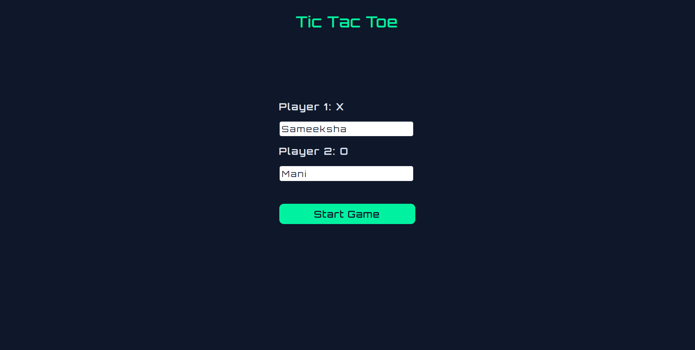
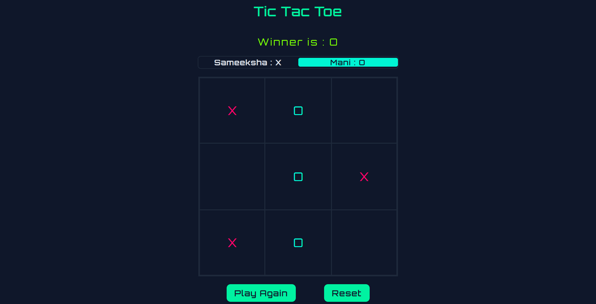

# Tic Tac Toe Game

A simple **Tic Tac Toe** game built with **HTML, CSS, and JavaScript** for two players. Features turn-based gameplay, winner/draw detection, and play again functionality.

---

## Live Demo

[Play Tic Tac Toe](https://sameeksha-dalvi.github.io/tic-tac-toe/)

---

## Features

- Enter **custom player names**.  
- **Turn indicator** for players.  
- Detects **win or draw** and disables further moves.  
- **Reset** and **Play Again** functionality.  

---

## Technologies & Concepts

- **HTML, CSS, JavaScript**  
- **Modular JavaScript** using IIFEs  
- **Factory functions** for players  
- **DOM manipulation** & event handling  
- **Game logic** for win/draw detection  

---

## Screenshots

  
  

---

